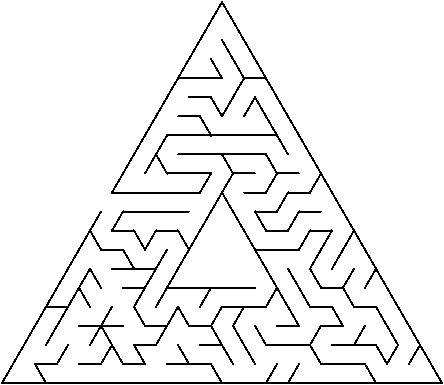
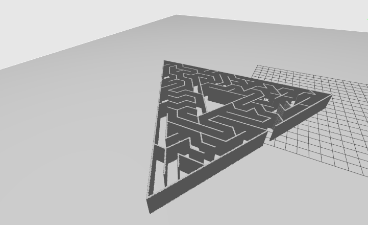

# Map2Gz: Optimized Map to SDF Converter

**High-Precision 2D Occupancy Grid to 3D World Converter**

Convert 2D SLAM maps (PGM + YAML) into 3D Gazebo worlds (SDF format) with **automatic parameter optimization**. Unlike simple converters, this tool offers multiple detection algorithms to handle both **exact binary maps** and **noisy SLAM maps** with high fidelity.

## :sparkles: Key Features

*   **:dart: Precision Modes:**
    *   **RLE (Run-Length Encoding):** 100% pixel-perfect reconstruction for exact/clean maps.
    *   **Contour:** Best for organic shapes and complex geometries.
    *   **Hough:** Classic line detection for noisy/approximate straight walls.
*   **:robot: Auto-Tuning:** Includes a hyperparameter optimizer that compares the output against the input to find the perfect settings for your specific map.
*   **:zap: Lightweight:** No ROS installation required to run the converter.

## :package: Installation

**No cloning needed!** Just download the files:

1. Download [`pgm_to_sdf.py`](pgm_to_sdf.py) (Converter) and [`auto_tune_hyperparams.py`](auto_tune_hyperparams.py) (Optimizer)
2. Install dependencies:

```bash
pip install numpy PyYAML Pillow opencv-python scipy scikit-image
```

## :rocket: Usage

### 1. Quick Start (Best for Exact Maps)
For clean, computer-generated maps (like mazes), use the **RLE** method for perfect accuracy:

```bash
python pgm_to_sdf.py map.pgm map.yaml --method rle
```

### 2. Standard Usage (Noisy/SLAM Maps)
For maps created by robots (Gmapping/SLAM Toolbox), the **Hough** method often works best to simplify jagged walls:

```bash
python pgm_to_sdf.py map.pgm map.yaml --method hough --threshold 128
```

### 3. Automatic Optimization :trophy:
Not sure which parameters to use? Let the auto-tuner find the best configuration for you. It generates multiple worlds, compares them to the original, and reports the best match.

```bash
python auto_tune_hyperparams.py map.pgm map.yaml
```

## :bar_chart: Benchmark & Optimization Results

We tested various methods on exact orthogonal mazes. Here is why **RLE** is the recommended default for clean maps:

| Method | Best IoU | Best F1 | Best Combined Score |
|--------|----------|---------|---------------------|
| **RLE** | **99.49%** | **99.74%** | **0.9902** |
| Hough | 17.43% | 29.69% | 0.3932 |
| Contour | 12.95% | 22.93% | 0.3460 |

**Key Findings:**
*   **RLE (Run-Length Encoding)** is the best method for clean/exact PGM maps, achieving **99.93% Pixel Accuracy** and generating efficient geometry (e.g., only 189 wall boxes for a complex maze).
*   **Hough Line Detection** is suitable for noisy maps where you want to approximate jagged walls with straight lines, but it sacrifices pixel-perfect accuracy.

## :gear: Parameters

| Parameter | Default | Description |
|-----------|---------|-------------|
| `--method` | `rle` | Detection algorithm: `rle` (exact), `contour` (shapes), `hough` (lines), `pixel` (grid), `freecad` (3D model) |
| `--output` / `-o` | `slam_world.sdf` | Output SDF filename |
| `--height` | `2.0` | Wall height in meters |
| `--thickness` | `0.1` | Wall thickness in meters (Hough/Contour only) |
| `--threshold` | `128` | Pixel threshold (0-255) for wall detection |
| `--sensitivity` | `1.0` | Line detection sensitivity (Hough only) |
| `--freecad-script-only` | `false` | Generate FreeCAD Python script without running it (FreeCAD method only) |

## :wrench: How It Works

1.  **Load Map** :inbox_tray: - Reads PGM image and YAML metadata.
2.  **Analyze Geometry** :mag: - Applies the selected algorithm:
    *   *RLE:* Scans pixels row-by-row to create exact blocks.
    *   *Hough:* Probabilistic line detection to approximate walls.
    *   *Contour:* Traces the outline of obstacles.
    *   *FreeCAD:* Converts contours to 3D model via FreeCAD CLI.
3.  **Scale to World** :earth_americas: - Converts pixel coordinates to real-world meters using YAML resolution.
4.  **Generate SDF** :outbox_tray: - Outputs a Gazebo-compatible world file with collision and visual elements.

## :triangular_ruler: FreeCAD Method (3D Model Export)

The `freecad` method provides an alternative approach using FreeCAD CLI to create true 3D models:

```bash
# Convert map to 3D model (requires FreeCAD installed)
python pgm_to_sdf.py map.pgm map.yaml --method freecad

# Generate FreeCAD script only (can run on another machine with FreeCAD)
python pgm_to_sdf.py map.pgm map.yaml --method freecad --freecad-script-only
```

**Features:**
- Creates STEP (.stp) files that can be used in CAD software
- Supports curved walls and complex geometries
- Exports FreeCAD document (.FCStd) for further editing
- Generates SDF file that references the 3D mesh

**Requirements:**
- FreeCAD with CLI support (`freecadcmd` or `FreeCADCmd`)
- Install: `sudo apt install freecad` (Ubuntu) or `brew install freecad` (macOS)

You can also use the standalone converter:
```bash
python pgm_to_freecad.py map.pgm map.yaml -o output_directory
```

## :soon: Future Roadmap

We are actively working on the following features:

*   **:broom: Advanced Denoising:** Pre-processing filters to clean up "salt-and-pepper" noise from raw SLAM maps before conversion.
*   **:robot: Isaac Sim Support:** Exporting to USD (Universal Scene Description) format for compatibility with NVIDIA Isaac Sim.
*   **:art: Texture Support:** Automatically applying textures to walls based on semantic data.

## :camera: Example: Input vs Output

| Input (2D SLAM Map) | Output (3D Gazebo World) |
|---------------------|--------------------------|
|  |  |

**Input YAML metadata:**
```yaml
image: map_3.pgm
mode: trinary
resolution: 0.05
origin: [-8.29, -8.64, 0]
negate: 0
occupied_thresh: 0.65
free_thresh: 0.25
```

## :file_folder: File Structure

Your map files should look like:
- `map_3.pgm` - Grayscale occupancy grid (black = walls, white = free space)
- `map_3.yaml` - Metadata with resolution, origin, and other parameters

## :video_game: Using in Gazebo

```bash
gz sim slam_world.sdf
```

The generated world includes:
- :sunrise: Proper lighting
- :office: 3D walls from your 2D map  
- :earth_americas: Ground plane
- :zap: Physics simulation ready

## :game_die: Maze Generator

Generate random mazes using [mazegenerator.net](https://www.mazegenerator.net/) and convert them to ROS 2 maps automatically.

### Usage

```bash
python3 maps/maze_robot_pgm_genrator.py --width 20 --height 20 --robot-size 0.5
```

This will:
1.  Fetch a maze from the website.
2.  Convert it to PGM.
3.  Calculate the resolution so that a robot with the specified `robot-size` (diameter in meters) can navigate the corridors.
4.  Save the map to `generated_maps/`.

**Note:** Requires `cairosvg` for SVG processing.
